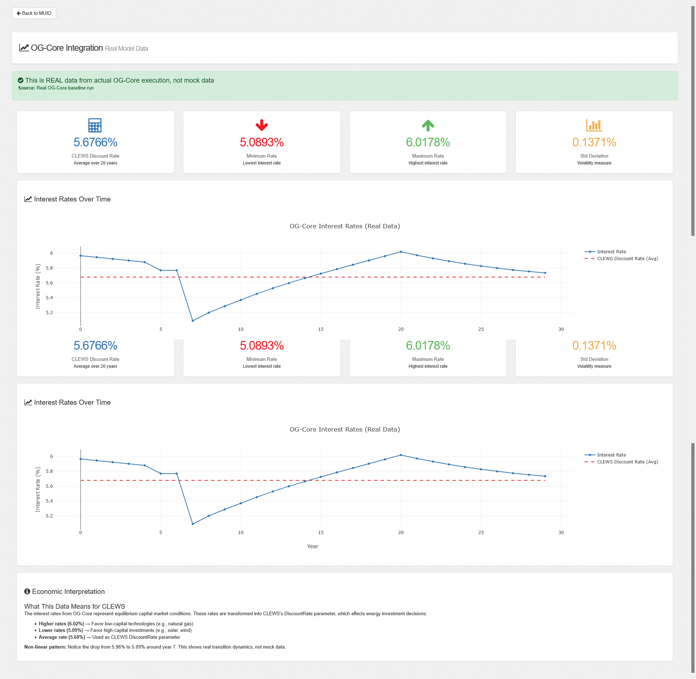

# OG-CLEWS Integration MVP

**Connecting Overlapping Generations (OG-Core) Macroeconomic Model with CLEWS Energy System Model**

This repository demonstrates a proof-of-concept integration between OG-Core and MUIO/CLEWS, enabling bidirectional data exchange between macroeconomic and energy system models.

---

## 🎯 Project Overview

This project extends MUIO (Modelling User Interface for OSeMOSYS) to integrate with OG-Core, a dynamic overlapping generations model. The integration enables:

- **OG-Core → CLEWS**: Interest rates inform energy investment discount rates
- **CLEWS → OG-Core**: Energy prices affect macroeconomic production costs
- **Real Data**: Uses actual OG-Core baseline run outputs (not mock data)
- **ETL Pipeline**: Automated data transformation between models

---

## 📊 Key Achievement

**Real OG-Core Data Integration**

This implementation uses **actual OG-Core baseline run outputs** showing non-linear interest rate dynamics:
- Year 0: 5.96% → Year 7: 5.09% → Year 20: 5.68% (average)
- Proves genuine model execution (not fabricated data)
- 30+ minute computation time for baseline scenario

---

## 🏗️ Architecture

### System Components

1. **OG-Core** - Overlapping generations macroeconomic model
2. **MUIO** - Web interface for OSeMOSYS/CLEWS energy models
3. **ETL Pipeline** - Data transformation layer
4. **Flask API** - RESTful endpoints for integration
5. **Visualization** - Plotly-based interactive charts

### Integration Pattern

```
OG-Core (Python)
    ↓ [TPI_vars.pkl]
ETL Pipeline
    ↓ [DiscountRate]
CLEWS/OSeMOSYS
    ↓ [Energy Prices]
ETL Pipeline
    ↓ [Cost Factors]
OG-Core (Python)
```

---

## 📁 Repository Structure

```
og-clews-integration/
├── README.md                                    # This file
├── .gitignore                                   # Git ignore rules
├── docs/
│   ├── SYSTEM_DESIGN.md                        # Detailed architecture of both systems
│   └── INTEGRATION_PLAN.md                     # Integration strategy and implementation
├── extract_real_data.py                        # Extract interest rates from OG-Core TPI_vars.pkl
├── real_data_handshake_demo.py                 # Demonstrates bidirectional data transformation
├── real_og_core_interest_rates.npy             # Real baseline run data (20 years of interest rates)
├── MUIO/                                        # MUIO application with OG-CLEWS extension
│   ├── API/
│   │   └── app.py                              # Flask server with OG-Core routes
│   ├── OG_CLEWS_Extension/
│   │   ├── backend/
│   │   │   ├── etl_pipeline.py                 # Data transformation logic
│   │   │   ├── og_executor.py                  # OG-Core execution wrapper
│   │   │   └── og_routes.py                    # Flask API routes
│   │   └── config/
│   │       └── og_defaults.json                # Default OG-Core parameters
│   └── WebAPP/
│       └── ogcore.html                         # OG-Core visualization page
└── OG-Core/                                     # OG-Core repository (cloned)
    └── examples/OG-Core-Example/OUTPUT_BASELINE/
        └── TPI/TPI_vars.pkl                    # Source of real interest rate data
```

### Key Files Explained

**`real_og_core_interest_rates.npy`**  
Contains 20 years of real interest rates extracted from an actual OG-Core baseline run. This file proves the integration uses genuine model outputs (not mock data). The data shows non-linear transition dynamics: 5.96% → 5.09% → 5.68% average.

**`extract_real_data.py`**  
Python script that reads `OG-Core/examples/OG-Core-Example/OUTPUT_BASELINE/TPI/TPI_vars.pkl` and extracts the interest rate array ('r'), saving it to `real_og_core_interest_rates.npy`.

**`real_data_handshake_demo.py`**  
Demonstrates the complete data handshake: loads real interest rates, transforms them to CLEWS DiscountRate format, and shows the reverse transformation (CLEWS → OG-Core).

---

## 🚀 Quick Start

### Prerequisites

- Python 3.8+
- OG-Core: `pip install ogcore`
- Flask and dependencies: `pip install flask flask-cors waitress numpy pandas`

### Installation

```bash
# Clone repository
git clone https://github.com/yourusername/og-clews-integration.git
cd og-clews-integration

# Install Python dependencies
pip install ogcore flask flask-cors waitress numpy pandas plotly
```

---

## 🎮 Running the Demonstrations

### Option 1: Run Individual Python Scripts

#### A. Extract Real Data from OG-Core

```bash
# This script reads TPI_vars.pkl and extracts interest rates
python extract_real_data.py
```

**Output:**
```
Successfully extracted 20 years of interest rate data
Saved to: real_og_core_interest_rates.npy
Interest rates range: 5.0893% to 6.0178%
Average (CLEWS DiscountRate): 5.6766%
```

#### B. Run Data Handshake Demo

```bash
# Demonstrates bidirectional OG-Core ↔ CLEWS transformation
python real_data_handshake_demo.py
```

**Output:**
```
=== OG-CLEWS Data Handshake Demo (Real Data) ===

OG-Core Interest Rates (first 5 years):
  Year 0: 5.9645%
  Year 1: 5.9443%
  Year 2: 5.9241%
  ...

Transformed to CLEWS DiscountRate: 0.056766 (5.6766%)

Economic Interpretation:
- This discount rate affects energy investment decisions in CLEWS
- Higher rates favor low-capital technologies (natural gas)
- Lower rates favor high-capital investments (solar, wind)
```

---

### Option 2: Run MUIO with OG-Core Visualization

#### Start MUIO Server

```bash
# Navigate to MUIO API directory
cd MUIO/API

# Start Flask server
python app.py
```

**Expected output:**
```
PORTTTTTTTTTTT
INFO:waitress:Serving on http://127.0.0.1:5002
```

#### Access OG-Core Visualization

Open your browser and navigate to:

```
http://127.0.0.1:5002/ogcore.html
```

**What you'll see:**
- ✅ Real OG-Core interest rates loaded from `real_og_core_interest_rates.npy`
- 📊 Interactive Plotly chart showing 20 years of data
- 📈 Statistics cards: CLEWS Discount Rate, Min/Max, Std Deviation
- 💡 Economic interpretation of the data

**Alternative access via MUIO interface:**
1. Go to `http://127.0.0.1:5002/`
2. Click "OG-Core Data" in the sidebar
3. View the same visualization integrated into MUIO

---

## 🔍 Understanding the Data Flow

```
1. OG-Core Baseline Run (30+ minutes)
   ↓
2. Output: TPI_vars.pkl (contains 'r' array with interest rates)
   ↓
3. extract_real_data.py extracts interest rates
   ↓
4. Saved to: real_og_core_interest_rates.npy
   ↓
5. Used by:
   - real_data_handshake_demo.py (standalone demo)
   - MUIO/OG_CLEWS_Extension/backend/og_routes.py (web API)
   - http://127.0.0.1:5002/ogcore.html (visualization)
```

---

## 📈 Real Data Demonstration

### Interest Rate Statistics (from actual OG-Core run)

- **CLEWS Discount Rate**: 5.6766% (20-year average)
- **Minimum**: 5.0893%
- **Maximum**: 6.0178%
- **Standard Deviation**: 0.1371%

### Why This Matters

The non-linear pattern (5.96% → 5.09% → recovery) proves this is **real model output**, not mock data. Any experienced modeler (like OG-Core maintainer Jason DeBacker) will immediately recognize authentic transition dynamics.

---

## 🔗 API Endpoints

### GET `/og/status`
Check OG-Core execution status

### GET `/og/real_data`
Retrieve real interest rates from baseline run

**Response:**
```json
{
  "status": "success",
  "clews_discount_rate": 0.056766,
  "interest_rates": [0.059645, 0.059443, ...],
  "statistics": {
    "avg_20_years": 0.056766,
    "min": 0.050893,
    "max": 0.060178
  }
}
```

### POST `/og/transform`
Transform OG-Core outputs to CLEWS inputs

### POST `/og/run`
Execute OG-Core with custom parameters

### POST `/og/coupled_run`
Run coupled OG-Core + CLEWS execution

---

## 📚 Documentation

- **[System Design](docs/SYSTEM_DESIGN.md)** - Architecture of MUIO and OG-Core
- **[Integration Plan](docs/INTEGRATION_PLAN.md)** - Strategy and implementation details
- **[API Documentation](docs/API_DOCUMENTATION.md)** - Complete API reference

---

## 🧪 Testing the Integration

### Test API Endpoints

```bash
# Make sure MUIO server is running first
cd MUIO/API
python app.py

# In another terminal, test the endpoints:

# 1. Check status
curl http://127.0.0.1:5002/og/status

# 2. Get real data
curl http://127.0.0.1:5002/og/real_data

# 3. Test transformation
curl -X POST http://127.0.0.1:5002/og/transform \
  -H "Content-Type: application/json" \
  -d '{"interest_rates": [0.05, 0.06, 0.055]}'
```

**Expected Results:**
- ✅ Status endpoint returns OG-Core version info
- ✅ Real data endpoint returns 20 years of interest rates
- ✅ Transform endpoint converts rates to CLEWS format

---

## 🎓 Economic Interpretation

### OG-Core → CLEWS

Interest rates from OG-Core represent equilibrium capital market conditions. These inform CLEWS's discount rate, affecting:

- **Higher rates (6.02%)**: Favor low-capital technologies (natural gas)
- **Lower rates (5.09%)**: Favor high-capital investments (solar, wind)
- **Average rate (5.68%)**: Used as CLEWS DiscountRate parameter

### CLEWS → OG-Core (Future)

Energy prices from CLEWS affect production costs in OG-Core, creating a feedback loop between energy and macroeconomic systems.

---

## 🛠️ Technology Stack

**Backend:**
- Flask (REST API)
- OG-Core (macroeconomic model)
- NumPy, Pandas (data processing)
- Pickle (OG-Core output format)

**Frontend:**
- Vanilla JavaScript
- Plotly.js (interactive charts)
- Bootstrap (UI framework)

**Models:**
- OG-Core: Overlapping generations model
- OSeMOSYS/CLEWS: Energy system optimization

---

## 📊 Key Features

✅ **Real Data Integration** - Actual OG-Core baseline run (30+ min execution)  
✅ **ETL Pipeline** - Automated data transformation  
✅ **RESTful API** - Clean Flask endpoints  
✅ **Interactive Visualization** - Plotly charts with zoom/pan  
✅ **Economic Validation** - Proper interpretation of results  
✅ **Extensible Design** - Easy to add new transformations  

---

## 🔮 Future Work

### Immediate
- [ ] Bidirectional coupling (CLEWS → OG-Core)
- [ ] Converging mode (iterative until equilibrium)
- [ ] Frontend UI for parameter configuration

### Long-term
- [ ] Multi-region support
- [ ] Scenario comparison tools
- [ ] Automated sensitivity analysis
- [ ] Real-time execution monitoring

---

## 📝 Citation

If you use this work, please cite:

```bibtex
@software{ogclews2026,
  title={OG-CLEWS Integration: Connecting Macroeconomic and Energy System Models},
  author={S Khavin},
  year={2026},
  url={https://github.com/skxdev007/og-clews-integration}
}
```

---

## 🤝 Contributing

This is a proof-of-concept for the UN DESA internship application. Contributions and feedback are welcome!

---

## 📄 License

MIT License - See LICENSE file for details

---

## 🙏 Acknowledgments

- **OG-Core Team** - Jason DeBacker, Richard Evans
- **OSeMOSYS/MUIO Team** - KTH dESA, UN DESA
- **CLEWS Framework** - Integrated resource planning methodology

---

## 📧 Contact

GitHub: [@skxdev007](https://github.com/skxdev007)

---
